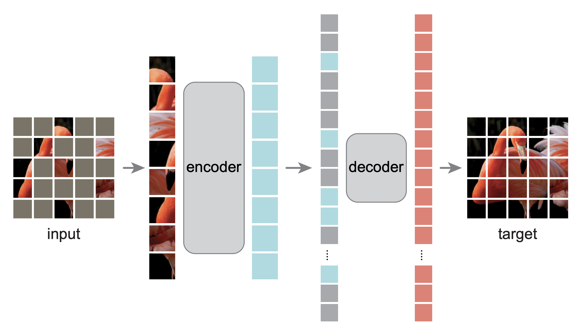

## Implementation of [*Kaiming He el.al. Masked Autoencoders Are Scalable Vision Learners*](https://arxiv.org/abs/2111.06377).

<div align="center">

  
  
</div>

## Installation
`pip install -r requirements.txt`


The paper "Masked Autoencoders Are Scalable Vision Learners" demonstrates that masked autoencoders (MAE) can be used as scalable self-supervised learners for computer vision by reconstructing missing pixels from random patches of input images, which is based on an asymmetric encoder-decoder architecture and a high proportion of masking input images. Key insights and lessons learned include the effectiveness and efficiency of the MAE approach for training large models with high capacity, which can generalize well and achieve high accuracy, and the promising scaling behavior and transfer performance in downstream tasks.

### Run

```bash
# pretrained with mae
python main.py

# train classifier from scratch
python main_clf.py
```

## Reference

```
@Article{MaskedAutoencoders2021,
  author  = {Kaiming He and Xinlei Chen and Saining Xie and Yanghao Li and Piotr Doll{\'a}r and Ross Girshick},
  journal = {arXiv:2111.06377},
  title   = {Masked Autoencoders Are Scalable Vision Learners},
  year    = {2021},
}
```
